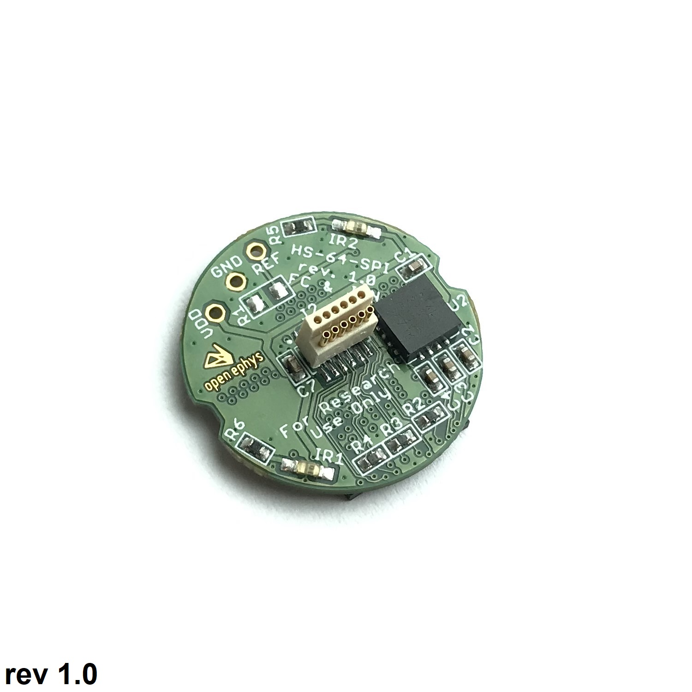

# Low-profile SPI Headstage with 64 ephys channels

## BOM

BOM can be found on [here][1].

## Accelerometer orientation

## Licensing

The designs, documentation, and photos available in this repository are free: you can redistribute it and/or modify it under the terms of the used license.
Check file named LICENSE.

Copyright Filipe Carvalho and Jonathan Newman 2020-2022

 This work is licensed under a <a rel="license" href="http://creativecommons.org/licenses/by-nc-sa/3.0/igo/">Creative Commons Attribution-NonCommercial-ShareAlike 3.0 IGO License</a>.

If your are interested in obtaining a license to sell this device, please contact info@open-ephys.org

[1]: https://docs.google.com/spreadsheets/d/1aobmmEzBDethzIlrm1eg0eYkBqlyX3s9WbA9KgRwVQI/edit?usp=sharing
